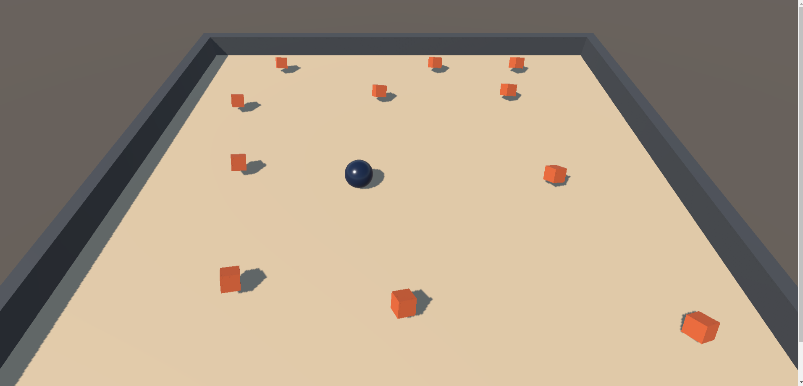

# Unity Roll-A-Ball Project

This is a repo for my Roll-A-Ball project which is based on a [Unity tutorial](https://learn.unity.com/project/roll-a-ball). 

The final game can be played [here](https://viviancan.dev/rollaball.html).

